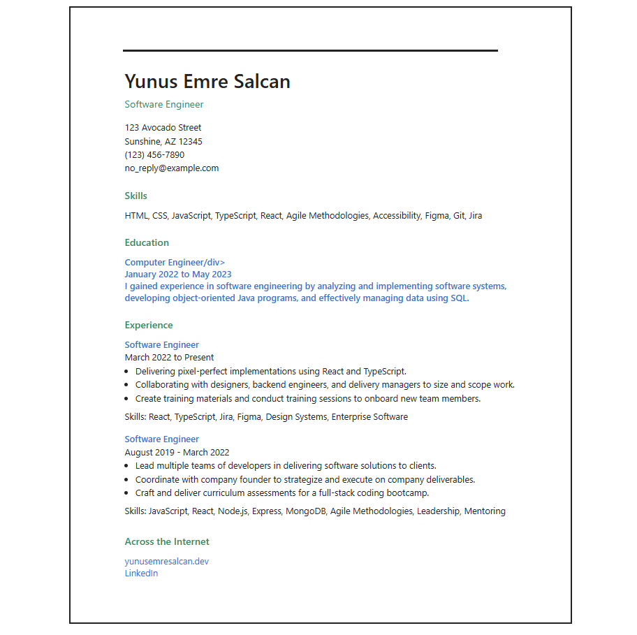

# 🦄 Awesome Single-Page HTML CV

This project is a clean, semantic, single-page CV (Curriculum Vitae) built with only HTML and CSS. It is inspired by the [roadmap.sh Single-Page CV Project](https://roadmap.sh/projects/single-page-cv).

## ✨ Features
- Semantic HTML5 structure for accessibility and SEO
- Modern, minimal design with a bordered layout
- Responsive and print-friendly
- Easy to customize for your own experience and skills

## 🚀 Getting Started
1. Clone or download this repository.
2. Open `index.html` in your browser to view the CV.
3. Edit `index.html` and `style.css` to personalize your information and style.

## 🖼️ Preview
See the screenshot above for a sample layout. For more details and the original project description, visit: [https://roadmap.sh/projects/single-page-cv](https://roadmap.sh/projects/single-page-cv)

## 🙏 Credits
- Project idea and requirements from [roadmap.sh](https://roadmap.sh/)
- Design inspired by the project reference image

---

> **Awesome**: This project is a great starting point for building your own professional, single-page CV with semantic HTML and beautiful CSS!
